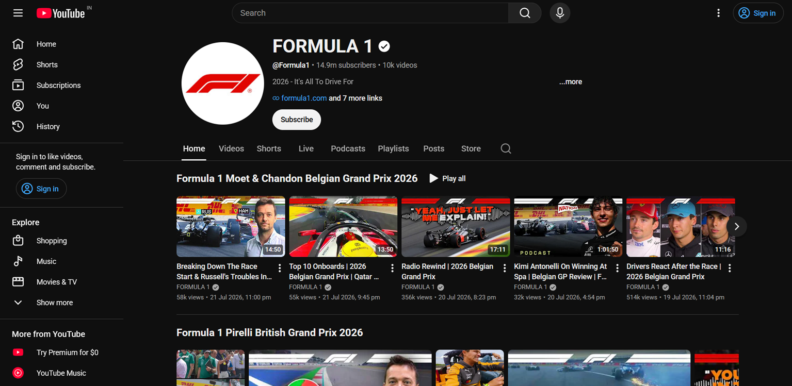
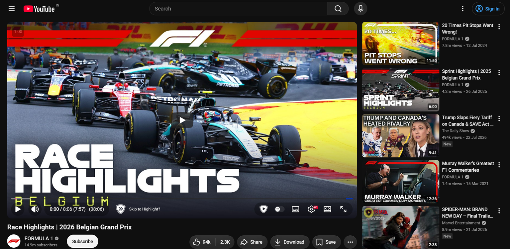
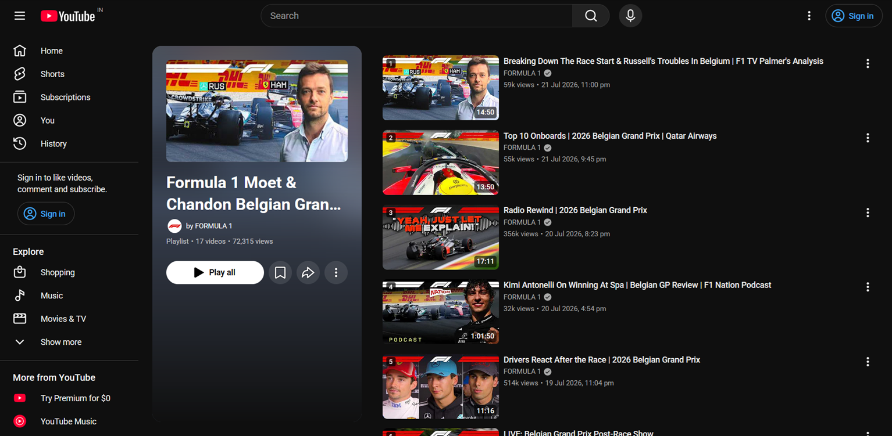
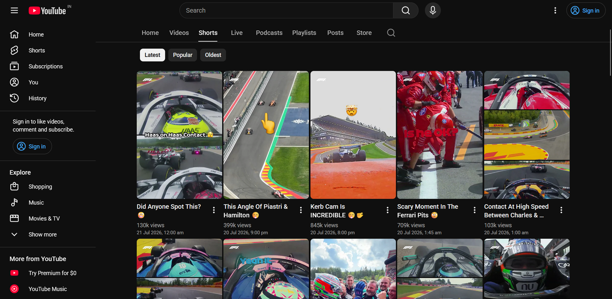
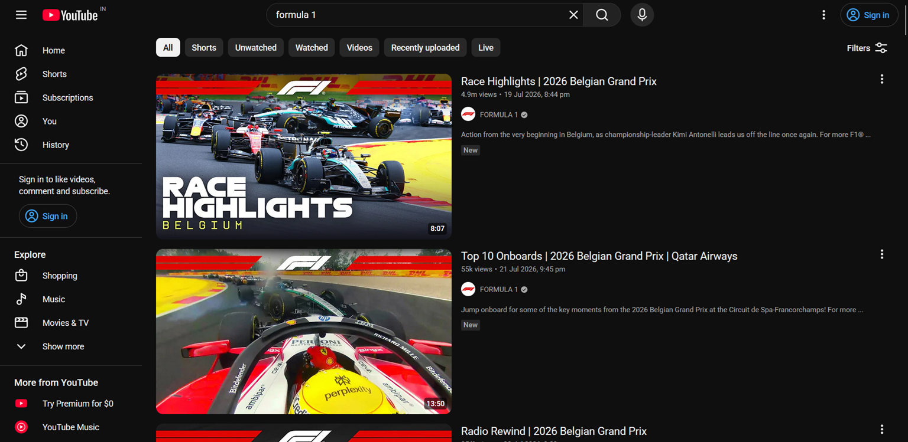
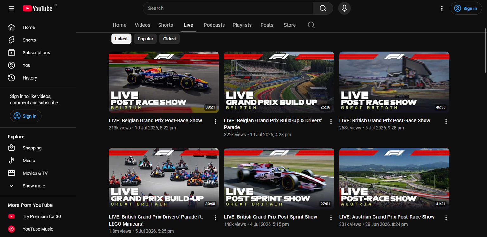

<h1 align="center">YouTube Show Absolute Date</h1>

<p align="center">
  Replace YouTube's vague relative upload dates (<b>"2 years ago"</b>) with precise, locale-aware <b>absolute dates</b> across the entire platform.
</p>

<p align="center">
  <a href="https://greasyfork.org/en/scripts/588066">
    
  </a>
</p>

<p align="center">
  
  
  
  
</p>

---

<details>
  <summary><b>Table of Contents</b> (click to expand)</summary>

- [✨ Features](#-features)
- [📸 Screenshots](#-screenshots)
- [📍 Supported Locations](#-supported-locations)
- [💡 Example](#-example)
- [🚀 Quick Installation](#-quick-installation)
- [⚙️ Configuration](#️-configuration)
- [🛠️ How It Works](#️-how-it-works)
- [🌐 Compatibility](#-compatibility)
- [🔒 Privacy](#-privacy)
- [🙏 Acknowledgements](#-acknowledgements)
- [🤝 Contributing](#-contributing)
- [📜 License](#-license)
</details>

---

## ✨ Features

- 📅 **Absolute Timestamps:** Replaces relative dates like "3 months ago" with exact dates and times.
- 🌍 **Locale-Aware:** Automatically formats dates according to your browser's language and regional settings.
- 🕒 **12-Hour / 24-Hour Support:** Configurable time formats to suit your preference.
- ⚡ **Lightweight & Fast:** Optimized for YouTube's Single Page Application (SPA) dynamic navigation.
- 🔒 **Privacy-First:** Zero external API calls, analytics, or third-party tracking.
- 💾 **Smart Caching:** Efficiently caches metadata to prevent redundant requests.

---

## 📸 Screenshots

| Home Page | Watch Page |
| :---: | :---: |
|  |  |

| Playlists | Shorts |
| :---: | :---: |
|  |  |

| Search Results | Live Streams |
| :---: | :---: |
|  |  |

---

## 📍 Supported Locations

| Location | Example Output |
| :--- | :--- |
| **Watch page description** | `4 Sep 2026, 11:15 pm` |
| **Home feed** | `4 Sep 2026, 11:15 pm` |
| **Search results** | `4 Sep 2026, 11:15 pm` |
| **Channel videos grid** | `4 Sep 2026, 11:15 pm` |
| **Playlist page & cards** | `4 Sep 2026, 11:15 pm` |
| **Shorts player & thumbnails** | `4 Sep 2026, 11:15 pm` |
| **End screen recommendations** | `4 Sep 2026, 11:15 pm` |
| **Watch page right sidebar** | `4 Sep 2026` |

---

## 💡 Example

| YouTube Default (Before) | With Script (After) |
| :--- | :--- |
| `3 years ago` | `12 Jul 2022, 10:15 pm` |
| `11 months ago` | `5 Sep 2024, 6:30 pm` |
| `2 weeks ago` | `10 Jun 2026, 8:00 am` |
| `Yesterday` | `8 Jul 2026, 5:42 pm` |

---

## 🚀 Quick Installation

1. Install a userscript manager extension for your browser:
   * [Violentmonkey](https://violentmonkey.github.io/) (*Recommended*)
   * [Tampermonkey](https://www.tampermonkey.net/)
   * [Greasemonkey](https://www.greasespot.net/)

2. Install the userscript:

<p align="center">
  <a href="https://greasyfork.org/en/scripts/588066">
    
  </a>
</p>

---

⚙️ Configuration
----------------

Inside the script:

```javascript
var USE_12_HOUR = true;
```

| Value | Output |
|------|--------|
| `true` | `10 May 2025, 10:16 pm` |
| `false` | `10 May 2025, 22:16` |

---

🛠️ How It Works
----------------

The userscript fetches precise upload timestamps directly from YouTube's internal responses using your active session context and seamlessly updates the UI text nodes.

-   **DOM Mutation Observer:** Detects dynamically loaded components as you scroll or navigate without requiring hard page reloads.

-   **In-Memory Caching:** Stores fetched dates locally during your session to minimize network requests and CPU load.

-   **Native Layout Preservation:** Swaps text values only, preserving YouTube's original CSS classes, styling, and structural elements.

🌐 Compatibility
----------------

### Supported Script Managers

-   ✅ **Violentmonkey** (Fully tested & recommended)

-   ✅ **Greasemonkey**

-   ✅ **Tampermonkey**


### Supported Browsers

-   ✅ **Chromium**, **Firefox**, **Edge**, **Helium**, **Waterfox**, **Floorp** (via Violentmonkey/Greasemonkey/Tampermonkey)

🔒 Privacy
----------

This userscript is built with a zero-telemetry approach:

-   ❌ **No Data Collection:** Zero tracking, logging, or analytics.

-   ❌ **No Third-Party Requests:** All requests stay strictly between your browser and YouTube.

-   ❌ **No API Keys Required:** Works out of the box using your active YouTube session.

-   ❌ **Zero External Dependencies:** Built with clean, native JavaScript.

🙏 Acknowledgements
-------------------

Inspired by previous community userscripts:

-   **[YouTube Date Display](https://greasyfork.org/scripts/561532)** by **kor-bim**

-   **[YouTube Precise Date Display Fixed](https://greasyfork.org/en/scripts/567066)** by **Homebrew Runner**


🤝 Contributing
---------------

Contributions, feature requests, and bug reports are welcome!

If YouTube updates its layout and causes an element date to stop updating, please open an **[Issue](https://github.com/PacificCosmophile/YouTube-Show-Absolute-Date/issues)**.

📜 License
----------

Distributed under the [MIT License](https://opensource.org/licenses/MIT).

---

---

<p align="center">
Made with ❤️ for YouTube users who prefer actual upload dates.
</p>
